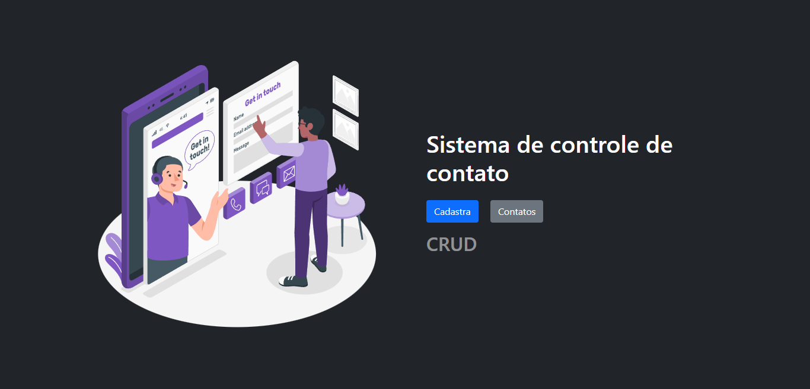

  <h1>Crud-Contatos</h1>

<h3 align="center">
 Aplicação para inscrição de newsletter com pagamento via stripe
</h3>

 <a href="#tecnologias">Tecnologias</a> • 
 <a href="#instalacao">Instalação</a> • 
 <a href="#autor">Autor</a>

### 🛠 Tecnologias

As seguintes ferramentas foram usadas na construção do projeto:

- [Html](https://developer.mozilla.org/pt-BR/docs/Web/HTML)
- [Jquery](https://jquery.com/)
- [Bootstrap 5](https://getbootstrap.com/docs/5.0/getting-started/introduction/)
- [C#](https://docs.microsoft.com/pt-br/dotnet/csharp/)
- [ASP.NET Core](https://docs.microsoft.com/pt-br/aspnet/core/?view=aspnetcore-6.0)
- [Sql Server](https://www.microsoft.com/pt-br/sql-server/sql-server-downloads)
  

## Pré-requisitos

Antes de começar, você vai precisar ter instalado em sua máquina as seguintes ferramentas:
[Git](https://git-scm.com),
[Sql Server](https://www.microsoft.com/pt-br/sql-server/sql-server-downloads),
[Visual Studio](https://visualstudio.microsoft.com/pt-br/downloads/).

### Autor

---

<a href="https://links-aldovani.netlify.app/">
 
  
 <b>Aldovani Henrique</b></a> <a href="https://links-aldovani.netlify.app/" >🚀</a>

Feito com ❤️ por Aldovani Henrique 👋🏻 Entre em contato!

